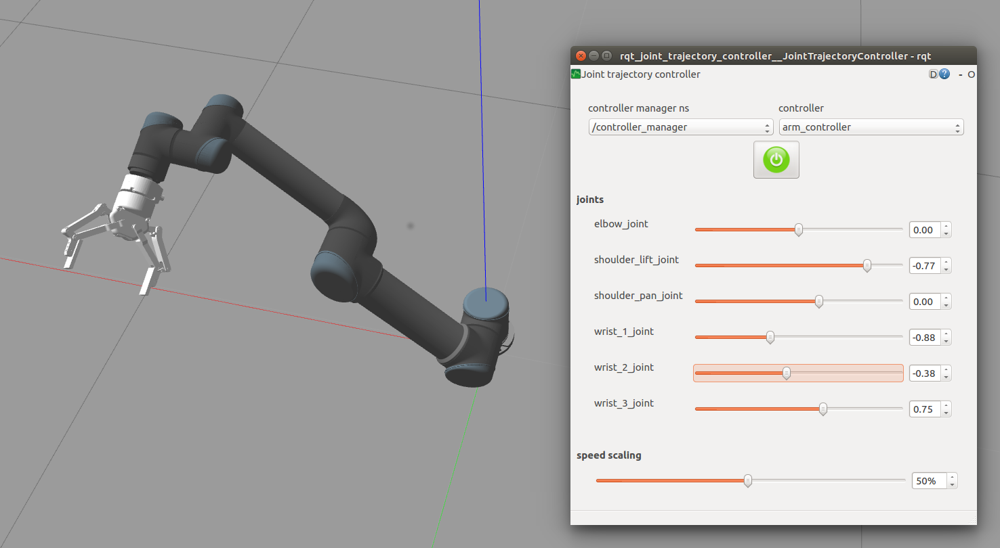

# ur5_with_robotiq_gripper
Author: Rui Cao

---
__ROS Version__ : Kinetic

__Dependence__

[universal_robot](https://github.com/ros-industrial/universal_robot) : URDFs and Meshes for UR5

[Universal_Robots_ROS_Driver](https://github.com/UniversalRobots/Universal_Robots_ROS_Driver) : Drivers for UR5.

[robotiq](https://github.com/ros-industrial/robotiq) : Drivers for the Robotiq gripper.

[roboticsgroup_gazebo_plugins](https://github.com/roboticsgroup/roboticsgroup_gazebo_plugins) : For the gripper simulation in Gazebo

[ros_controllers](https://github.com/ros-controls/ros_control) : For the CripperActionController. Can be installed with `sudo apt-get install ros-kinetic-ros-controllers`

---

__Usage with Gazebo simulation__



To start the Gazebo simulated ur5 and the gripper:

```roslaunch ur5_gripper_gazebo ur5_gripper_gazebo.launch```

Then bring up the moveit:

```roslaunch ur5_gripper_moveit_config ur5_gripper_moveit_planning_execution.launch sim:=true```

Finally, run a Rviz to visualize the trajectory:

```roslaunch ur5_gripper_moveit_config moveit_rviz.launch config:=true```

To bringup the slide bar for each joint:

```rosrun rqt_joint_trajectory_controller rqt_joint_trajectory_controller```

---

__Usage with the hardware__

In real hardware system, we use Onrobot RG6 gripper, however, the movable URDF model is unavailable now. We use Robotiq 140mm gripper as a replacement of URDF model in simulation and Moveit computation in planning.

First, copy the script "External_control.urp" that is in the folder "uscript" to the teachpad via usb disk, then run this script by "load program" button.

Then, to bring up the whole arm configuration with all drivers, you can use the following command:

```roslaunch ur5_gripper_bringup ur5_gripper_bringup.launch```

If there are some connection error, you may need to change the `robot_ip` in the launch file. To find the robot ip address:

UR’s teachpad -> Setup Robot -> Setup Network Menu -> ip address

After launched the bringup file, click the "play" button in teachpad, you would notice the info:"Robot ready to receive control commands".

Bring up the moveit:

```roslaunch ur5_gripper_moveit_config ur5_gripper_moveit_planning_execution.launch sim:=false```

Finally, run a Rviz to visualize the trajectory:

```roslaunch ur5_gripper_moveit_config moveit_rviz.launch config:=true```

---

__To control the gripper__

Publish the position value to `gripper/gripper_cmd/goal` (or the topic under a similar name). 

position value 0.0: close

position value 150: open with 150mm stroke

__Reference__

This repo learns a lot from [ur5_with_robotiq_gripper](https://github.com/intuitivecomputing/ur5_with_robotiq_gripper)
